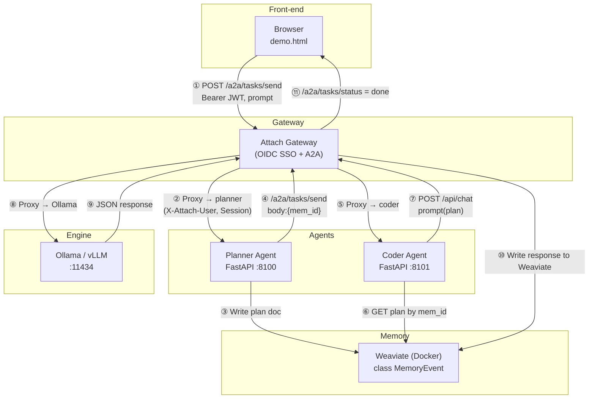

# Attach Gateway

> **Identity & Memory side‑car** for every LLM engine and multi‑agent framework. Add OIDC / DID SSO, A2A hand‑off, and a pluggable memory bus (Weaviate today) – all with one process.

[](https://pypi.org/project/attach-dev/)

---

## Why it exists

LLM engines such as **Ollama** or **vLLM** ship with **zero auth**.  Agent‑to‑agent protocols (Google **A2A**, MCP, OpenHands) assume a *Bearer token* is already present but don't tell you how to issue or validate it.  Teams end up wiring ad‑hoc reverse proxies, leaking ports, and copy‑pasting JWT code.

**Attach Gateway** is that missing resource‑server:

*   ✅ Verifies **OIDC / JWT** or **DID‑JWT**
*   ✅ Stamps `X‑Attach‑User` + `X‑Attach‑Session` headers so every downstream agent/tool sees the same identity
*   ✅ Implements `/a2a/tasks/send` + `/tasks/status` for Google A2A & OpenHands hand‑off
*   ✅ Mirrors prompts & responses to a memory backend (Weaviate Docker container by default)
*   ✅ Workflow traces (Temporal)

Run it next to any model server and get secure, shareable context in under 1 minute.

---

## 60‑second Quick‑start (local laptop)

### Option 1: Install from PyPI (Recommended)

```bash
# 0) prerequisites: Python 3.12, Ollama installed, Auth0 account or DID token

# Install the package
pip install attach-dev

# 1) start memory in Docker (background tab)
# Mac M1/M2 users: use manual Docker command (see examples/README.md)
docker run --rm -d -p 6666:8080 \
  -e AUTHENTICATION_ANONYMOUS_ACCESS_ENABLED=true \
  semitechnologies/weaviate:1.30.5

# 2) export your short‑lived token
export JWT="<paste Auth0 or DID token>"
export OIDC_ISSUER=https://YOUR_DOMAIN.auth0.com
export OIDC_AUD=ollama-local
export MEM_BACKEND=weaviate
export WEAVIATE_URL=http://127.0.0.1:6666

# 3) run gateway
attach-gateway --port 8080 &

# 4) make a protected Ollama call via the gateway
curl -H "Authorization: Bearer $JWT" \
     -d '{"model":"tinyllama","prompt":"hello"}' \
    http://localhost:8080/api/chat | jq .
```

### Option 2: Install from Source

```bash
# 0) prerequisites: Python 3.12, Ollama installed, Auth0 account or DID token

git clone https://github.com/attach-dev/attach-gateway.git && cd attach-gateway
python -m venv .venv && source .venv/bin/activate
pip install -r requirements.txt


# 1) start memory in Docker (background tab)

python script/start_weaviate.py &

# 2) export your short‑lived token
export JWT="<paste Auth0 or DID token>"
export OIDC_ISSUER=https://YOUR_DOMAIN.auth0.com
export OIDC_AUD=ollama-local
export MEM_BACKEND=weaviate
export WEAVIATE_URL=http://127.0.0.1:6666

# 3) run gateway
uvicorn main:app --port 8080 &

# The gateway exposes your Auth0 credentials for the demo UI at
# `/auth/config`. The values are read from `AUTH0_DOMAIN`,
# `AUTH0_CLIENT` and `OIDC_AUD`.

# 4) make a protected Ollama call via the gateway
curl -H "Authorization: Bearer $JWT" \
     -d '{"model":"tinyllama","prompt":"hello"}' \
    http://localhost:8080/api/chat | jq .
```

In another terminal, try the Temporal demo:

```bash
pip install temporalio  # optional workflow engine
python examples/temporal_adapter/worker.py &
python examples/temporal_adapter/client.py
```

You should see a JSON response plus `X‑ATTACH‑Session‑Id` header – proof the pipeline works.

---

## Use in your project

1. Copy `.env.example` → `.env` and fill in OIDC + backend URLs  
2. `pip install attach-dev python-dotenv`  
3. `attach-gateway` (reads .env automatically)

→ See **[docs/configuration.md](docs/configuration.md)** for framework integration and **[examples/](examples/)** for code samples.

---

## Architecture (planner → coder hand‑off)


```mermaid
flowchart TD
    %%────────────────────────────────
    %%  COMPONENTS  
    %%────────────────────────────────
    subgraph Front-end
        UI["Browser<br/> demo.html"]
    end

    subgraph Gateway
        GW["Attach Gateway<br/> (OIDC SSO + A2A)"]
    end

    subgraph Agents
        PL["Planner Agent<br/>FastAPI :8100"]
        CD["Coder Agent<br/>FastAPI :8101"]
    end

    subgraph Memory
        WV["Weaviate (Docker)\nclass MemoryEvent"]
    end

    subgraph Engine
        OL["Ollama / vLLM<br/>:11434"]
    end

    %%────────────────────────────────
    %%  USER FLOW
    %%────────────────────────────────
    UI -- ① POST /a2a/tasks/send<br/>Bearer JWT, prompt --> GW

    %%─ Planner hop
    GW -- ② Proxy → planner<br/>(X-Attach-User, Session) --> PL
    PL -- ③ Write plan doc --> WV
    PL -- ④ /a2a/tasks/send\nbody:{mem_id} --> GW

    %%─ Coder hop
    GW -- ⑤ Proxy → coder --> CD
    CD -- ⑥ GET plan by mem_id --> WV
    CD -- ⑦ POST /api/chat\nprompt(plan) --> GW
    GW -- ⑧ Proxy → Ollama --> OL
    OL -- ⑨ JSON response --> GW
    GW -- ⑩ Write response to Weaviate --> WV
    GW -- ⑪ /a2a/tasks/status = done --> UI
```

**Key headers**

| Header | Meaning |
|--------|---------|
| `Authorization: Bearer <JWT>` | OIDC or DID token proved by gateway |
| `X‑Attach‑User` | stable user ID (`auth0|123` or `did:pkh:…`) |
| `X‑Attach‑Session` | deterministic hash (user + UA) for request trace |

---

## Live two‑agent demo

```bash

# pane 1 – memory (Docker)
python script/start_weaviate.py

# pane 2 – gateway
uvicorn main:app --port 8080

# pane 3 – planner agent
uvicorn examples.agents.planner:app --port 8100

# pane 4 – coder agent
uvicorn examples.agents.coder:app   --port 8101

# pane 5 – static chat UI
cd examples/static && python -m http.server 9000
open http://localhost:9000/demo.html
```
Type a request like *"Write Python to sort a list."*  The browser shows:
1. Planner message   → logged in gateway, plan row appears in memory.
2. Coder reply       → code response, second memory row, status `done`.

---

## Directory map

| Path | Purpose |
|------|---------|
| `auth/` | OIDC & DID‑JWT verifiers |
| `middleware/` | JWT middleware, session header, mirror trigger |
| `a2a/` | `/tasks/send` & `/tasks/status` routes |
| `mem/` | pluggable memory writers (`weaviate.py`, `sakana.py`) |
| `proxy/` | Engine-agnostic HTTP proxy logic |
| `examples/agents/` | *examples* – Planner & Coder FastAPI services |
| `examples/static/` | `demo.html` chat page |

---

### Auth core

`auth.verify_jwt()` accepts three token formats and routes them automatically:

1. Standard OIDC JWTs
2. `did:key` tokens
3. `did:pkh` tokens

Example DID-JWT request:
```bash
curl -X POST /v1/resource \
     -H "Authorization: Bearer did:key:z6Mki...<sig>.<payload>.<sig>"
```

Example OIDC JWT request:
```bash
curl -X POST /v1/resource \ 
     -H "Authorization: Bearer $JWT"
```

Other IdPs (Descope)
To use your OIDC provider, set the following environment variables:
```bash
OIDC_ISSUER=<your-oidc-issuer>
OIDC_AUD=<your-oidc-audience>
AUTH_BACKEND=<your-authentication-provider>
```
Descope-specific environment variables:
```bash
DESCOPE_BASE_URL=https://api.descope.com or <your-descope-base-url>
DESCOPE_PROJECT_ID=<your-descope-project-id>
DESCOPE_CLIENT_ID=<your-descope-inbound-app-client-id>
DESCOPE_CLIENT_SECRET=<your-descope-inbound-app-client-secret>
```

## 💾 Memory: logs

Send Sakana-formatted logs to the gateway and they will be stored as
`MemoryEvent` objects in Weaviate.

```bash
curl -X POST /v1/logs \
     -H "Authorization: Bearer $JWT" \
     -d '{"run_id":"abc","level":"info","message":"hi"}'
# => HTTP/1.1 202 Accepted
```

## Roadmap

* **v0.2** — Protected‑resource metadata endpoint (OAuth 2.1), enhanced DID resolvers.  
* **v0.3** — Token‑exchange (RFC 8693) for on‑behalf‑of delegation.  
* **v0.4** — Attach Store v1 (Git‑style, policy guards).

---

## License

MIT
