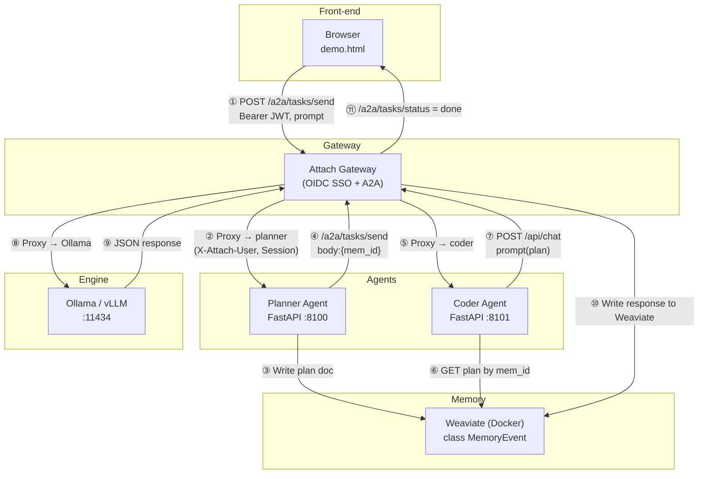

# Attach Gateway

> **Identity & Memory side‑car** for every LLM engine and multi‑agent framework. Add OIDC / DID SSO, A2A hand‑off, and a pluggable memory bus (Weaviate today) – all with one process.

[](https://pypi.org/project/attach-dev/)

---

## Why it exists

LLM engines such as **Ollama** or **vLLM** ship with **zero auth**.  Agent‑to‑agent protocols (Google **A2A**, MCP, OpenHands) assume a *Bearer token* is already present but don't tell you how to issue or validate it.  Teams end up wiring ad‑hoc reverse proxies, leaking ports, and copy‑pasting JWT code.

**Attach Gateway** is that missing resource‑server:

*   ✅ Verifies **OIDC / JWT** or **DID‑JWT**
*   ✅ Stamps `X‑Attach‑User` + `X‑Attach‑Session` headers so every downstream agent/tool sees the same identity
*   ✅ Implements `/a2a/tasks/send` + `/tasks/status` for Google A2A & OpenHands hand‑off
*   ✅ Mirrors prompts & responses to a memory backend (Weaviate Docker container by default)
*   ✅ Workflow traces (Temporal)

Run it next to any model server and get secure, shareable context in under 1 minute.

---

## 60‑second Quick‑start (local laptop)

### Option 1: Install from PyPI (Recommended)

```bash
# 0) prerequisites: Python 3.12, Ollama installed, Auth0 account or DID token

# Install the package
pip install attach-dev

# 1) start memory in Docker (background tab)
# Mac M1/M2 users: use manual Docker command (see examples/README.md)
docker run --rm -d -p 6666:8080 \
  -e AUTHENTICATION_ANONYMOUS_ACCESS_ENABLED=true \
  semitechnologies/weaviate:1.30.5

# 2) export your short‑lived token
export JWT="<paste Auth0 or DID token>"
export OIDC_ISSUER=https://YOUR_DOMAIN.auth0.com
export OIDC_AUD=ollama-local
export MEM_BACKEND=weaviate
export WEAVIATE_URL=http://127.0.0.1:6666

# 3) run gateway
attach-gateway --port 8080 &

# 4) make a protected Ollama call via the gateway
curl -H "Authorization: Bearer $JWT" \
     -d '{"model":"tinyllama","messages":[{"role":"user","content":"hello"}]}' \
    http://localhost:8080/api/chat | jq .
```

### Option 2: Install from Source

```bash
# 0) prerequisites: Python 3.12, Ollama installed, Auth0 account or DID token

git clone https://github.com/attach-dev/attach-gateway.git && cd attach-gateway
python -m venv .venv && source .venv/bin/activate
pip install -r requirements.txt


# 1) start memory in Docker (background tab)

python script/start_weaviate.py &

# 2) export your short‑lived token
export JWT="<paste Auth0 or DID token>"
export OIDC_ISSUER=https://YOUR_DOMAIN.auth0.com
export OIDC_AUD=ollama-local
export MEM_BACKEND=weaviate
export WEAVIATE_URL=http://127.0.0.1:6666

# 3) run gateway
uvicorn main:app --port 8080 &

# The gateway exposes your Auth0 credentials for the demo UI at
# `/auth/config`. The values are read from `AUTH0_DOMAIN`,
# `AUTH0_CLIENT` and `OIDC_AUD`.

# 4) make a protected Ollama call via the gateway
curl -H "Authorization: Bearer $JWT" \
     -d '{"model":"tinyllama","messages":[{"role":"user","content":"hello"}]}' \
    http://localhost:8080/api/chat | jq .
```

In another terminal, try the Temporal demo:

```bash
pip install temporalio  # optional workflow engine
python examples/temporal_adapter/worker.py &
python examples/temporal_adapter/client.py
```

You should see a JSON response plus `X‑ATTACH‑Session‑Id` header – proof the pipeline works.

---

## Claude Code + MCP Gateway (Local-First, 2-Minute Setup)

Attach Gateway can act as a **local MCP (Model Context Protocol) reverse proxy** for Claude Code, providing:
- JWT-authenticated access control for all MCP tool calls
- Per-user daily quota enforcement (configurable glob patterns)
- Local audit logs (SQLite) for compliance & debugging
- Web-based console UI for monitoring

This feature is **opt-in** and does not affect the core OIDC sidecar functionality.

### Quick Setup

```bash
# 1. Install Attach Gateway
pip install attach-dev

# 2. Configure your MCP servers (HTTP upstream only in MVP)
mkdir -p ~/.attach
cat > ~/.attach/mcp.json <<EOF
{
  "version": 1,
  "servers": {
    "notion": {
      "enabled": true,
      "url": "http://localhost:7001/mcp",
      "headers": {
        "Authorization": "env:NOTION_TOKEN"
      }
    }
  }
}
EOF

# 3. Optional: Configure quotas
cat > ~/.attach/mcp_policy.json <<EOF
{
  "version": 1,
  "enabled": true,
  "per_user_daily_tool_calls": {
    "notion.*": 100,
    "github.*": 200,
    "*": 1000
  }
}
EOF

# 4. Start the gateway with MCP enabled
export OIDC_ISSUER=https://YOUR_DOMAIN.auth0.com
export OIDC_AUD=your-api-identifier
export ATTACH_ENABLE_MCP=true

attach-gateway --port 8080
```

### Integrate with Claude Code

```bash
# Generate Claude Code configuration commands
attach-gateway claude install --project .

# Or manually add servers:
claude mcp add --transport http --name "notion" --url "http://localhost:8080/mcp/notion"
```

### Use the Console UI

1. Get a JWT token from your OIDC provider
2. Open http://localhost:8080/console
3. Paste your Bearer token when prompted
4. View MCP call statistics, audit logs, and server status

### MCP CLI Commands

```bash
# List configured servers
attach-gateway mcp list

# Add a new server
attach-gateway mcp add github http://localhost:7002/mcp \
  --header "Authorization: env:GITHUB_TOKEN"

# Enable/disable servers
attach-gateway mcp enable github
attach-gateway mcp disable github

# Remove a server
attach-gateway mcp remove github
```

### How It Works

1. Claude Code sends JSON-RPC requests to `http://localhost:8080/mcp/{server}`
2. Gateway validates your JWT Bearer token
3. Gateway checks quota limits (if enabled)
4. Gateway forwards request to configured upstream MCP server
5. Gateway logs metadata (timestamp, user, tool, latency) to local SQLite
6. Response is returned to Claude Code

**Security Notes:**
- `/mcp/*` endpoints require Bearer JWT authentication
- Console UI data endpoints (`/console/api/*`) require JWT
- Console landing page and static assets are unauthenticated (no sensitive data)
- Audit logs contain metadata only (no request/response bodies)
- All data stays local by default (no phone-home)

---

## Use in your project

1. Copy `.env.example` → `.env` and fill in OIDC + backend URLs  
2. `pip install attach-dev python-dotenv`  
3. `attach-gateway` (reads .env automatically)

→ See **[docs/configuration.md](docs/configuration.md)** for framework integration and **[examples/](examples/)** for code samples.

---

## Architecture (planner → coder hand‑off)


```mermaid
flowchart TD
    %%────────────────────────────────
    %%  COMPONENTS  
    %%────────────────────────────────
    subgraph Front-end
        UI["Browser<br/> demo.html"]
    end

    subgraph Gateway
        GW["Attach Gateway<br/> (OIDC SSO + A2A)"]
    end

    subgraph Agents
        PL["Planner Agent<br/>FastAPI :8100"]
        CD["Coder Agent<br/>FastAPI :8101"]
    end

    subgraph Memory
        WV["Weaviate (Docker)\nclass MemoryEvent"]
    end

    subgraph Engine
        OL["Ollama / vLLM<br/>:11434"]
    end

    %%────────────────────────────────
    %%  USER FLOW
    %%────────────────────────────────
    UI -- ① POST /a2a/tasks/send<br/>Bearer JWT, prompt --> GW

    %%─ Planner hop
    GW -- ② Proxy → planner<br/>(X-Attach-User, Session) --> PL
    PL -- ③ Write plan doc --> WV
    PL -- ④ /a2a/tasks/send\nbody:{mem_id} --> GW

    %%─ Coder hop
    GW -- ⑤ Proxy → coder --> CD
    CD -- ⑥ GET plan by mem_id --> WV
    CD -- ⑦ POST /api/chat\nprompt(plan) --> GW
    GW -- ⑧ Proxy → Ollama --> OL
    OL -- ⑨ JSON response --> GW
    GW -- ⑩ Write response to Weaviate --> WV
    GW -- ⑪ /a2a/tasks/status = done --> UI
```

**Key headers**

| Header | Meaning |
|--------|---------|
| `Authorization: Bearer <JWT>` | OIDC or DID token proved by gateway |
| `X‑Attach‑User` | stable user ID (`auth0|123` or `did:pkh:…`) |
| `X‑Attach‑Session` | deterministic hash (user + UA) for request trace |

---

## Live two‑agent demo

```bash

# pane 1 – memory (Docker)
python script/start_weaviate.py

# pane 2 – gateway
uvicorn main:app --port 8080

# pane 3 – planner agent
uvicorn examples.agents.planner:app --port 8100

# pane 4 – coder agent
uvicorn examples.agents.coder:app   --port 8101

# pane 5 – static chat UI
cd examples/static && python -m http.server 9000
open http://localhost:9000/demo.html
```
Type a request like *"Write Python to sort a list."*  The browser shows:
1. Planner message   → logged in gateway, plan row appears in memory.
2. Coder reply       → code response, second memory row, status `done`.

---

## Directory map

| Path | Purpose |
|------|---------|
| `auth/` | OIDC & DID‑JWT verifiers |
| `middleware/` | JWT middleware, session header, mirror trigger |
| `a2a/` | `/tasks/send` & `/tasks/status` routes |
| `mem/` | pluggable memory writers (`weaviate.py`, `sakana.py`) |
| `proxy/` | Engine-agnostic HTTP proxy logic |
| `examples/agents/` | *examples* – Planner & Coder FastAPI services |
| `examples/static/` | `demo.html` chat page |

---

## Auth core

`auth.verify_jwt()` accepts three token formats and routes them automatically:

1. Standard OIDC JWTs
2. `did:key` tokens
3. `did:pkh` tokens

Example DID-JWT request:
```bash
curl -X POST /v1/resource \
     -H "Authorization: Bearer did:key:z6Mki...<sig>.<payload>.<sig>"
```

Example OIDC JWT request:
```bash
curl -X POST /v1/resource \ 
     -H "Authorization: Bearer $JWT"
```

### Other IdPs (Descope)
To use your OIDC provider, set the following environment variables:
```bash
OIDC_ISSUER=<your-oidc-issuer>
OIDC_AUD=<your-oidc-audience>
AUTH_BACKEND=<your-authentication-provider>
```
Descope-specific environment variables:
```bash
DESCOPE_BASE_URL=https://api.descope.com or <your-descope-base-url>
DESCOPE_PROJECT_ID=<your-descope-project-id>
DESCOPE_CLIENT_ID=<your-descope-inbound-app-client-id>
DESCOPE_CLIENT_SECRET=<your-descope-inbound-app-client-secret>
```

## 💾 Memory: logs

Send Sakana-formatted logs to the gateway and they will be stored as
`MemoryEvent` objects in Weaviate.

```bash
curl -X POST /v1/logs \
     -H "Authorization: Bearer $JWT" \
     -d '{"run_id":"abc","level":"info","message":"hi"}'
# => HTTP/1.1 202 Accepted
```

## Usage hooks

Emit token usage metrics for every request. Choose a backend via
`USAGE_METERING` (alias `USAGE_BACKEND`):

```bash
export USAGE_METERING=prometheus  # or null
```

A Prometheus counter `attach_usage_tokens_total{user,direction,model}` is
exposed for Grafana dashboards.
Set `USAGE_METERING=null` (the default) to disable metering entirely.

> **⚠️ Usage hooks depend on the quota middleware.**  
> Make sure `MAX_TOKENS_PER_MIN` is set (any positive number) so the  
> `TokenQuotaMiddleware` is enabled; the middleware is what records usage  
> events that feed Prometheus.

```bash
# Enable usage tracking (set any reasonable limit)
export MAX_TOKENS_PER_MIN=60000
export USAGE_METERING=prometheus
```

#### OpenMeter (Stripe / ClickHouse)

```bash
# No additional dependencies needed - uses direct HTTP API
export MAX_TOKENS_PER_MIN=60000              # Required: enables quota middleware
export USAGE_METERING=openmeter              # Required: activates OpenMeter backend  
export OPENMETER_API_KEY=your-api-key-here   # Required: API authentication
export OPENMETER_URL=https://openmeter.cloud # Optional: defaults to https://openmeter.cloud
```

Events are sent directly to OpenMeter's HTTP API and are processed by the LLM tokens meter for billing integration with Stripe.

> **⚠️ All three variables are required for OpenMeter to work:**  
> - `MAX_TOKENS_PER_MIN` enables the quota middleware that records usage events  
> - `USAGE_METERING=openmeter` activates the OpenMeter backend  
> - `OPENMETER_API_KEY` provides authentication to OpenMeter's API  

The gateway gracefully falls back to `NullUsageBackend` if any required variable is missing.

### Scraping metrics

```bash
curl -H "Authorization: Bearer $JWT" http://localhost:8080/metrics
```

## Token quotas

Attach Gateway can enforce per-user token limits. Install the optional
dependency with `pip install attach-dev[quota]` and set
`MAX_TOKENS_PER_MIN` in your environment to enable the middleware. The
counter defaults to the `cl100k_base` encoding; override with
`QUOTA_ENCODING` if your model uses a different tokenizer. The default
in-memory store works in a single process and is not shared between
workers—requests retried across processes may be double-counted. Use Redis
for production deployments.
If `tiktoken` is missing, a byte-count fallback is used which counts about
four times more tokens than the `cl100k` tokenizer – install `tiktoken` in
production.

### Enable token quotas

```bash
# Optional: Enable token quotas
export MAX_TOKENS_PER_MIN=60000
pip install tiktoken  # or pip install attach-dev[quota]
```

To customize the tokenizer:
```bash
export QUOTA_ENCODING=cl100k_base  # default
```

---

## License

MIT
