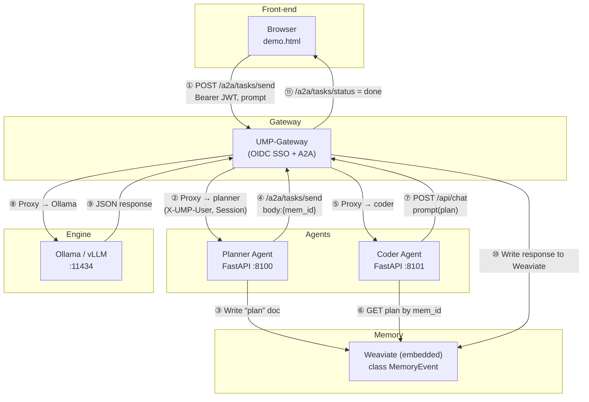

# UMP‑Gateway

> **Identity & Memory side‑car** for every LLM engine and multi‑agent framework. Add OIDC / DID SSO, A2A hand‑off, and a pluggable memory bus (Weaviate today) – all with one process.

---

## Why it exists

LLM engines such as **Ollama** or **vLLM** ship with **zero auth**.  Agent‑to‑agent protocols (Google **A2A**, MCP, OpenHands) assume a *Bearer token* is already present but don’t tell you how to issue or validate it.  Teams end up wiring ad‑hoc reverse proxies, leaking ports, and copy‑pasting JWT code.

**UMP‑Gateway** is that missing resource‑server:

*   ✅ Verifies **OIDC / JWT** or **DID‑JWT**
*   ✅ Stamps `X‑UMP‑User` + `X‑UMP‑Session` headers so every downstream agent/tool sees the same identity
*   ✅ Implements `/a2a/tasks/send` + `/tasks/status` for Google A2A & OpenHands hand‑off
*   ✅ Mirrors prompts & responses to a memory backend (Weaviate embedded by default)

Run it next to any model server and get secure, shareable context in under 1 minute.

---

## 60‑second Quick‑start (local laptop)

```bash
# 0) prerequisites: Python 3.12, Ollama installed, Auth0 account or DID token

git clone https://github.com/<you>/ump-gateway.git && cd ump-gateway
python -m venv .venv && source .venv/bin/activate
pip install -r requirements.txt weaviate-client[embedded]

# 1) start embedded memory (background tab)
python scripts/start_weaviate.py &

# 2) export your short‑lived token
export JWT="<paste Auth0 or DID token>"
export OIDC_ISSUER=https://YOUR_DOMAIN.auth0.com
export OIDC_AUD=ollama-local
export MEM_BACKEND=weaviate
export WEAVIATE_URL=http://127.0.0.1:6666

# 3) run gateway
uvicorn main:app --port 8080 &

# 4) make a protected Ollama call via the gateway
curl -H "Authorization: Bearer $JWT" \
     -d '{"model":"tinyllama","prompt":"hello"}' \
     http://localhost:8080/api/chat | jq .
```

You should see a JSON response plus `X‑UMP‑Session‑Id` header – proof the pipeline works.

---

## Architecture (planner → coder hand‑off)



**Key headers**

| Header | Meaning |
|--------|---------|
| `Authorization: Bearer <JWT>` | OIDC or DID token proved by gateway |
| `X‑UMP‑User` | stable user ID (`auth0|123` or `did:pkh:…`) |
| `X‑UMP‑Session` | deterministic hash (user + UA) for request trace |

---

## Live two‑agent demo (no Docker)

```bash
# pane 1 – memory
python scripts/start_weaviate.py

# pane 2 – gateway
uvicorn main:app --port 8080

# pane 3 – planner agent
uvicorn agents.planner:app --port 8100

# pane 4 – coder agent
uvicorn agents.coder:app   --port 8101

# pane 5 – static chat UI
cd examples/static && python -m http.server 9000
open http://localhost:9000/demo.html
```
Type a request like *“Write Python to sort a list.”*  The browser shows:
1. Planner message   → logged in gateway, plan row appears in memory.
2. Coder reply       → code response, second memory row, status `done`.

---

## Directory map

| Path | Purpose |
|------|---------|
| `auth/` | OIDC & (soon) DID‑JWT verifiers |
| `middleware/` | JWT middleware, session header, mirror trigger |
| `a2a/` | `/tasks/send` & `/tasks/status` routes |
| `mem/` | pluggable memory writers (`weaviate.py`, `null.py`) |
| `agents/` | *examples* – Planner & Coder FastAPI services |
| `examples/static/` | `demo.html` chat page |

---

## Roadmap

* **v0.2** — DID‑JWT resolver, protected‑resource metadata endpoint (OAuth 2.1).  
* **v0.3** — Token‑exchange (RFC 8693) for on‑behalf‑of delegation.  
* **v0.4** — UMP Store v1 (Git‑style, policy guards).

---

## License

MIT

