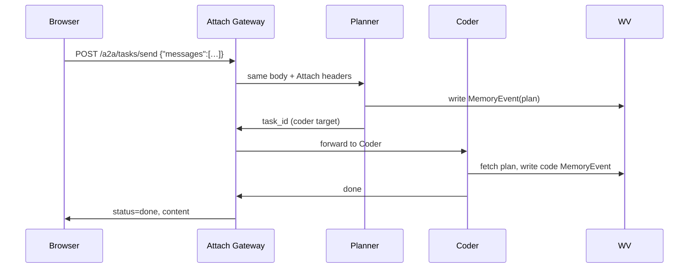

## 02‑google‑a2a.md — Worked example

Google’s **A2A** spec defines two endpoints:

* `POST /a2a/tasks/send` – create a task
* `GET  /a2a/tasks/status/{task_id}` – poll until `state: done`

### 1. Planner → Gateway → Coder flow



### 2. Minimal Python stub for an agent

```python
from fastapi import FastAPI, Request
from a2a.types import TaskSend, TaskStatus  # tiny helper dataclasses
from mem import write as mem_write

app = FastAPI()

@app.post("/a2a/handle")
async def handle(task: TaskSend, request: Request):
    # 1. Access Attach headers
    sub   = request.headers.get("X-Attach-User")
    sess  = request.headers.get("X-Attach-Session")

    # 2. Do your LLM call… (omitted)
    answer = "Hello, world!"

    # 3. Mirror to memory (optional)
    mem_write(
        role="coder",
        content=answer,
        user=sub,
        session_id=sess,
        task_id=request.headers.get("X-Attach-Task")
    )

    # 4. Return a TaskStatus payload
    return TaskStatus(state="done", result=answer)
```

### 3. Gateway quick‑test (curl)

```bash
JWT=$(node util/get_dev_token.js)

curl -H "Authorization: Bearer $JWT" \
     -d '{"messages":[{"role":"user","content":"hi"}]}' \
     http://localhost:8080/a2a/tasks/send | jq .
```

Poll `/tasks/status/{id}` until `state:"done"` and then open
`http://localhost:8080/mem/events` to see both Planner & Coder rows.
